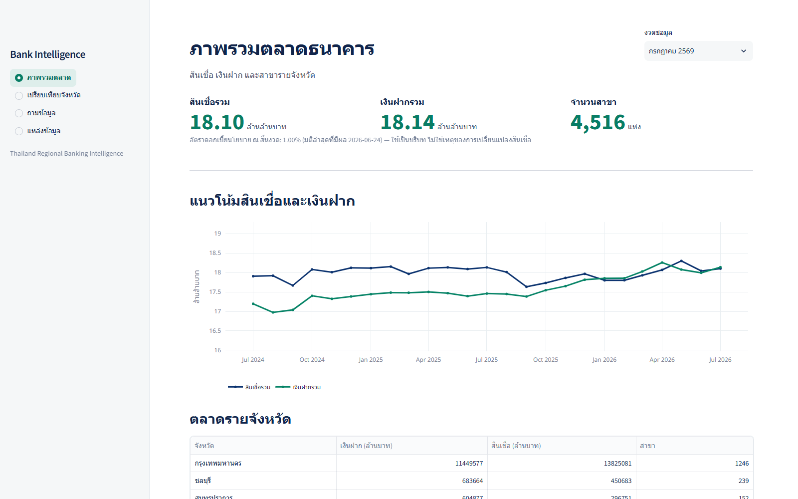
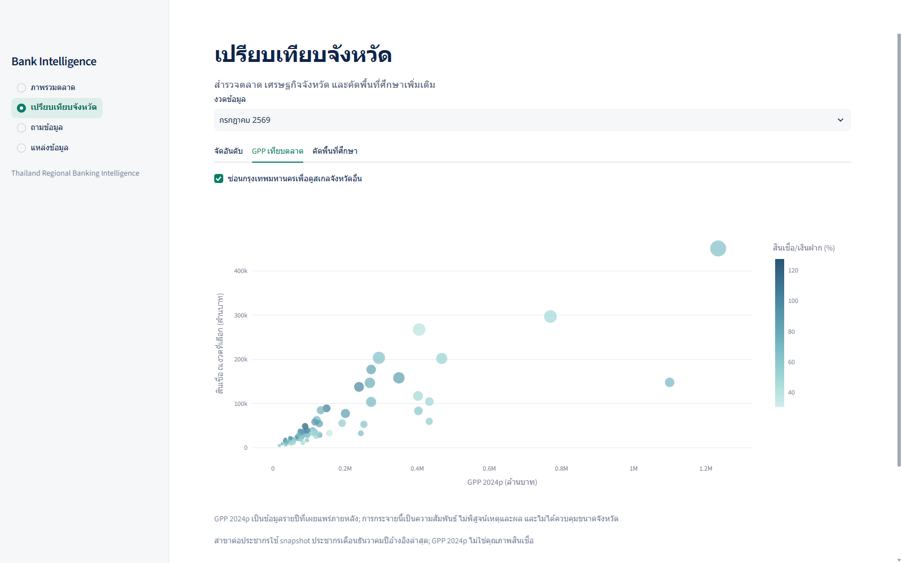
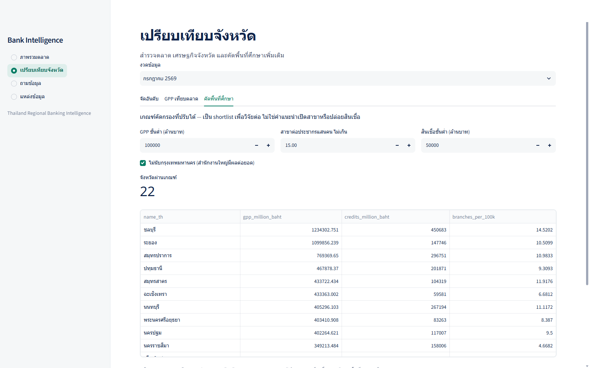
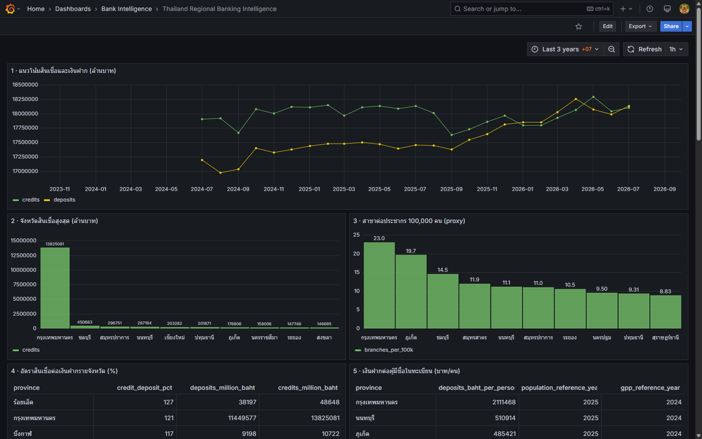
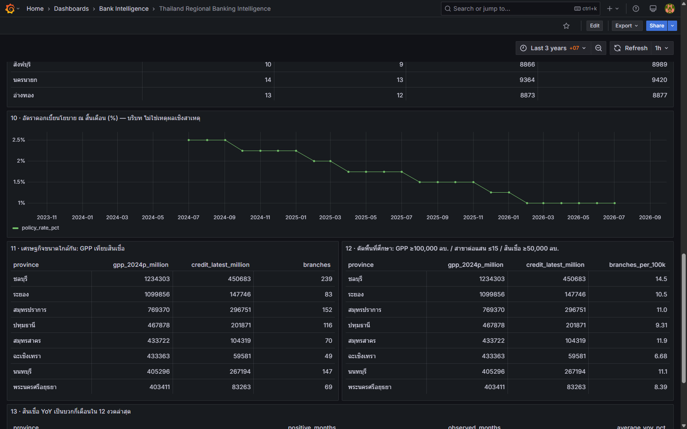
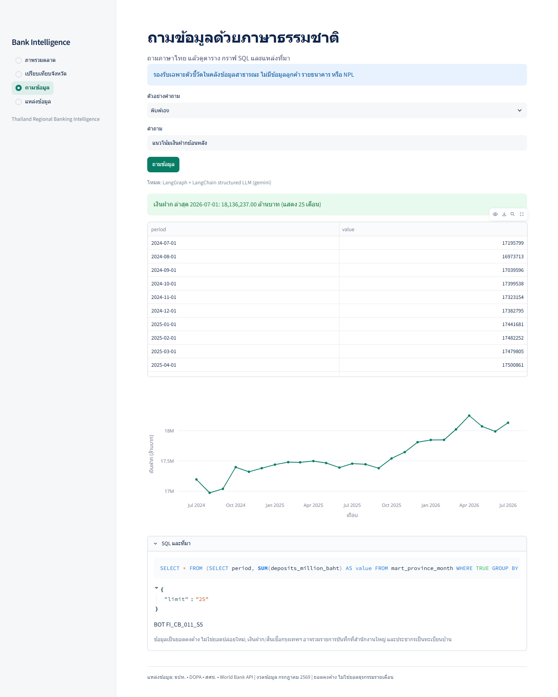
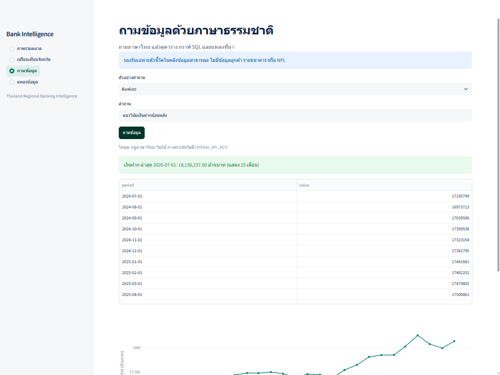
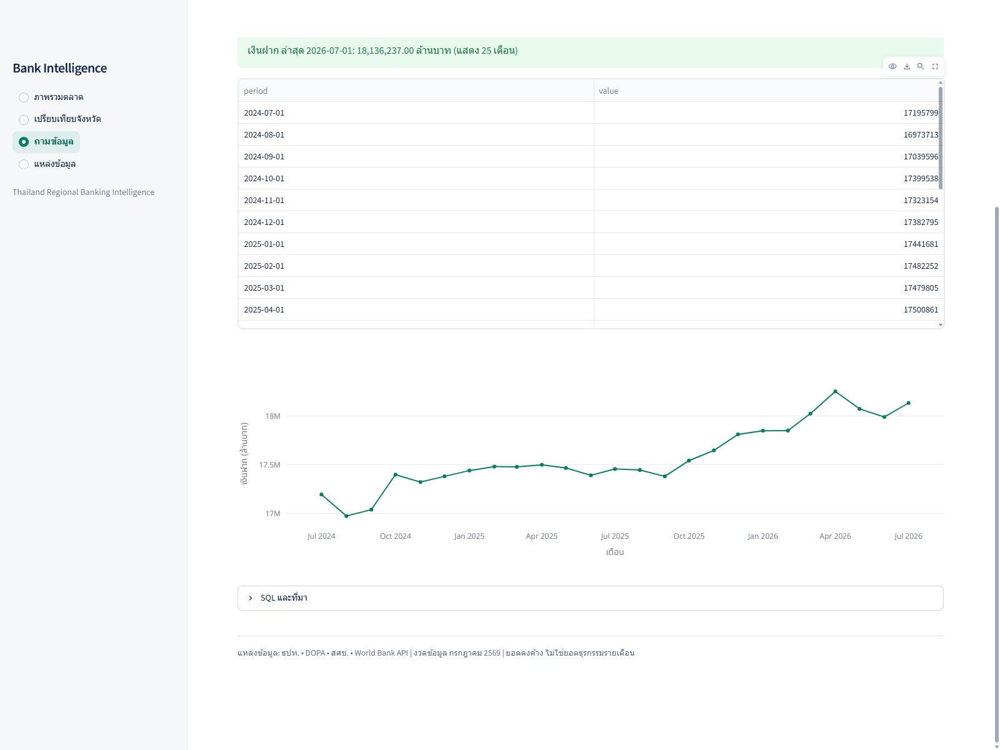

# Thailand Regional Banking Intelligence

An end-to-end analytics project for Thailand's provincial commercial-banking market: a PostgreSQL warehouse, scheduled ETL, Grafana and Streamlit dashboards, and a constrained natural-language query interface. It integrates **real public data** from multiple sources—no customer records, individual-bank records, or synthetic banking observations.

| Warehouse | Pipeline | Analytics | Verification |
|---|---|---|---|
| 77 provinces × 25 months | 5 real-data sources, daily Airflow DAG | 13 Grafana panels + interactive Streamlit | 38 passing tests |

The project is ready to run and demonstrate locally. Its verified data snapshot covers July 2024–July 2026; the source's latest banking period in this build is July 2026. See [validation and scope](#validation-and-scope) for the remaining operational and optional-LLM checks.

[ภาษาไทย / Thai documentation](README_TH.md) · [Business report](docs/business-report.md) · [Architecture and ER diagram](docs/architecture.md) · [Resume wording draft](docs/resume-draft.md) · [Submission PDF](output/pdf/thailand-regional-banking-intelligence-report.pdf)



## Why this project exists

A bank's strategy or channel-planning team may want to compare provincial loan and deposit growth, branch coverage, and economic context before selecting places for further investigation. The underlying publications have different geographic identifiers, grains, units, and release dates. This project resolves those differences into an auditable province–month mart and makes the result explorable. It is a **market-screening tool**, not a credit decision engine or a recommendation to open/close branches.

The dashboards address questions such as:

1. Which provinces have high and persistent year-over-year loan growth?
2. Where are deposits growing faster than loans?
3. How does branch density per 100,000 registered residents differ across provinces?
4. Do provinces with similar GPP have different banking-market sizes?
5. How did banking balances move over periods when the national policy rate changed? (Context, **not causation**.)
6. Where did branch counts fall while loan balances rose?
7. Which provinces pass adjustable thresholds for a follow-up market study?

The [business report](docs/business-report.md) gives answers from the loaded data, formulas, caveats, and next-step interpretation.

## Product screenshots

The dashboard screenshots were captured from the running local application on 28 September 2026; the Gemini chatbot screenshot below was captured on 30 September 2026. They show real warehouse results, not the [early design concept](docs/design/dashboard-concept.png).

| Provincial comparison | Adjustable opportunity screen |
|---|---|
|  |  |

| Grafana dashboard | National policy-rate context and GPP comparison |
|---|---|
|  |  |

The chatbot returns the query result, chart, generated SQL, and provenance. This live Gemini example maps a Thai deposit-trend question to a constrained `QueryPlan` and displays 25 monthly warehouse results. It is a successful end-to-end demonstration, not an LLM accuracy benchmark.



Without an API key, the same interface falls back to a clearly labelled **Thai rules mode**, shown in the earlier screenshots below.





The scheduled pipeline has five source tasks feeding a mart-build task. The [Airflow graph screenshot](docs/evidence/airflow-graph-qa.png) shows a successful six-task run.

## Architecture

```text
BOT banking web table ───┐
DOPA population files ───┤
NESDC GPP workbook ──────┤──> Python validation + raw SHA-256 snapshots
World Bank JSON API ─────┤        └──> PostgreSQL dimensions/facts
BOT MPC workbook ────────┘                   └──> province-month mart
                                                   ├──> Grafana (13 panels)
Airflow daily 07:00 ICT ──> protected FastAPI ETL ├──> Streamlit (4 sections)
                                                   └──> LangGraph chatbot
                                                        └──> bounded SQL + read-only DB role
```

The Airflow DAG is [`airflow/dags/bank_daily.py`](airflow/dags/bank_daily.py). Source adapters and loading logic are in [`bank/sources.py`](bank/sources.py) and [`bank/etl.py`](bank/etl.py). The schema is defined in [`bank/db.py`](bank/db.py); Grafana panels are provisioned from [`grafana/dashboards/regional-banking.json`](grafana/dashboards/regional-banking.json). See the [full architecture and ER diagram](docs/architecture.md).

## Data sources and joins

| Dataset | Actual ingestion method | Grain and loaded coverage | Role |
|---|---|---|---|
| [Bank of Thailand FI_CB_011_S5](https://app.bot.or.th/BTWS_STAT/statistics/BOTWEBSTAT.aspx?language=ENG&reportID=1008) | Official public web table via HTTP GET/form POST; **not a REST API** | Province × month; 77 × 25 = 1,925 rows | Loan and deposit balances in THB million; branch counts |
| [Department of Provincial Administration](https://stat.bora.dopa.go.th/new_stat/webPage/statByYear.php) | Official TXT files | Province × year; 77 × 3 = 231 rows (2023–2025) | Registered population |
| [NESDC GPP 2024p](https://www.nesdc.go.th/en/download/table-of-gross-regional-and-provincial-product-2024-excel/) | Official XLSX workbook | Province × year; 77 rows | Provincial gross product in THB million |
| [World Bank Indicators](https://api.worldbank.org/v2/country/THA/indicator/FP.CPI.TOTL.ZG?format=json&per_page=100) | **Real public JSON REST API**, no API key | Thailand × year; 65 non-null observations | National CPI inflation context |
| [Bank of Thailand MPC decisions](https://www.bot.or.th/en/our-roles/monetary-policy/mpc-publication/policy-interest-rate.html) | Official XLSX workbook; **not the BOT Policy Rate API** | Decision date; 191 events | National month-end policy-rate context |

Province names from BOT and NESDC are mapped through an explicit, reviewed **77-province crosswalk** to DOPA province codes. Aggregate rows such as *Grand Total* and *Head office* are excluded rather than double-counted. Unknown names fail validation instead of being fuzzy-matched.

The mart's grain is **province × banking month**. BOT balances are month-end stocks, so they can be summed across provinces within one month but **must not be summed over time**. DOPA population uses the last available December snapshot from the following January onward. NESDC GPP and World Bank inflation are only joined after their documented availability date. The policy rate is the latest decision effective no later than that banking month's end. Missing/unavailable values remain `NULL`, not zero. `source_manifest` records source URL, retrieval time, raw path, and SHA-256; `etl_run` records job outcomes.

Key measures include `loans / deposits × 100`, `branches / registered_population × 100,000`, and YoY growth versus the **same month in the previous year**. Branch density is only a proxy for access; registered population is not the number of bank customers. National inflation and policy rates are context, not province-specific predictors.

## Run locally

This is a Windows-oriented local demo. Install Docker Desktop and Python 3.13, then run these commands in PowerShell from the project root:

```powershell
docker compose up -d --build
py -3.13 -m venv .venv
.\.venv\Scripts\python.exe -m pip install -r requirements.txt
.\.venv\Scripts\python.exe -m bank.etl all
```

The last command performs the initial import from the live public sources. It requires internet access and may take several minutes. Source websites can change, so a future import may require an adapter update. Subsequent loads are scheduled by Airflow. The Docker Compose file persists PostgreSQL data in a named volume and raw snapshots under `data/raw/`.

| Service | Local address | Access |
|---|---|---|
| Streamlit application | http://127.0.0.1:8501 | No login in this local demo |
| Grafana | http://127.0.0.1:3001/d/thai-bank-regions | Development login: `admin` / `bank_dev_password` |
| Airflow | http://127.0.0.1:8081 | User `admin`; generated password via command below |
| FastAPI documentation | http://127.0.0.1:8000/docs | API reference |

```powershell
docker exec bank-airflow-1 cat /opt/airflow/standalone_admin_password.txt
```

**Security:** the hard-coded passwords and ETL token in [`compose.yaml`](compose.yaml) are for a loopback-only development environment. Do not expose this Compose stack to the internet or reuse these credentials. A deployment would need secret management, TLS, access control, logging, and rate limiting.

### Optional Gemini-backed chatbot

Without a Gemini or OpenAI API key, the app uses a clearly labelled deterministic Thai rules parser. To enable Gemini, copy [`.env.example`](.env.example) to `.env`, set your own `GEMINI_API_KEY`, and rebuild `api` and `dashboard`:

```powershell
Copy-Item .env.example .env
# Edit .env locally; do not commit or paste the key into chat.
docker compose up -d --build api dashboard
```

LangChain converts questions to a Pydantic `QueryPlan`; the model does **not** execute arbitrary SQL. Python compiles allowlisted metrics and dimensions into SQL, SQLGlot checks for a single SELECT against the mart, the result is row-limited, and PostgreSQL's `bank_reader` role cannot write. LangGraph stores per-session checkpoints in PostgreSQL. The default Gemini model is `gemini-2.5-flash`. The optional OpenAI path remains available via `OPENAI_API_KEY` and `OPENAI_MODEL`; Gemini takes precedence if both keys are present. Free-tier quotas and data-use terms depend on the provider. Do not ask this public-data demo about real customer information.

## Verify and inspect

```powershell
Invoke-RestMethod http://127.0.0.1:8000/health
.\.venv\Scripts\python.exe -m pytest -q
docker compose ps
docker exec bank-airflow-1 airflow dags list-runs -d bank_regional_daily --no-backfill
```

The latest database-backed run on **30 September 2026** had **38 passing tests**, covering 25 supported rules-mode questions, all 13 Grafana SQL queries, the province crosswalk, temporal no-lookahead joins, the latest-N-month trend window, read-only database privileges, and Gemini provider selection. See the [verification snapshot](docs/evidence/run-status.md) for earlier observed row counts and Airflow run IDs.

## Validation and scope

The implementation and screenshots above are based on a verified local snapshot from **28 September 2026**. The 25 months of warehouse data meet the data-history objective, but they do **not** prove a month of uninterrupted Airflow operation. If that operations evidence is required for submission, collect actual scheduled-run history and new screenshots after a continuous month of operation; do not infer it from the historical data range.

The key-free chatbot and its 25 supported question cases have been tested. On **30 September 2026**, one live Gemini smoke test of a Thai deposit-trend question succeeded: structured LLM mode returned a valid plan and 25 warehouse months without an error. This is not a broad LLM accuracy evaluation; OpenAI remains untested live. Likewise, a BOT Policy Rate **API** integration is not claimed: it requires credentials. Policy-rate data comes from BOT's official public workbook, while the World Bank Indicators feed is the project's live unauthenticated REST API.

BOT figures are rounded to THB millions; summing the 77 provinces can differ slightly from the independently rounded national *Grand Total*. Bangkok may reflect head-office booking. NESDC GPP 2024p and 2026 banking balances represent different reference periods. The charts show association and context, never causality.

This repository is a reproducible **local analytical prototype**, not a production banking system.
