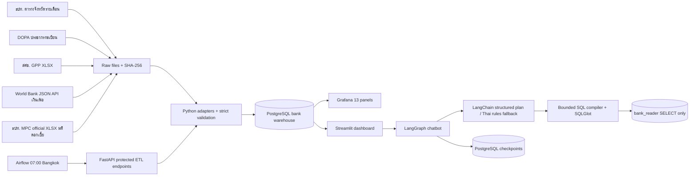
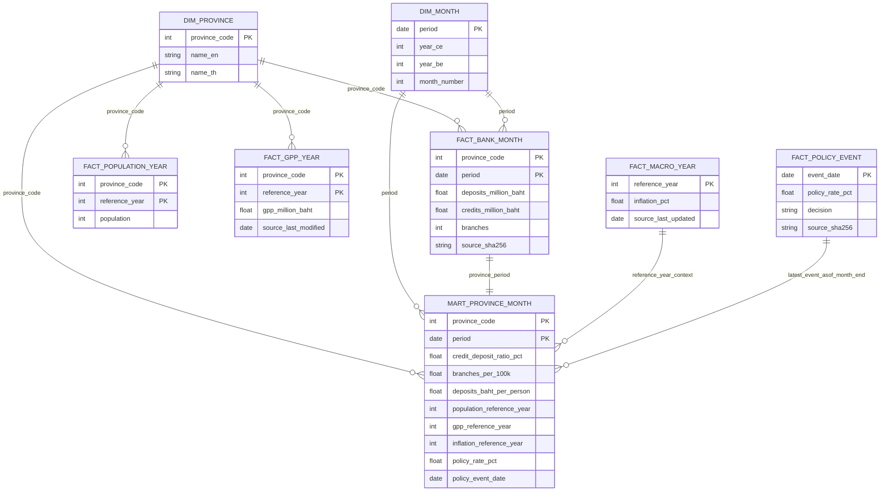
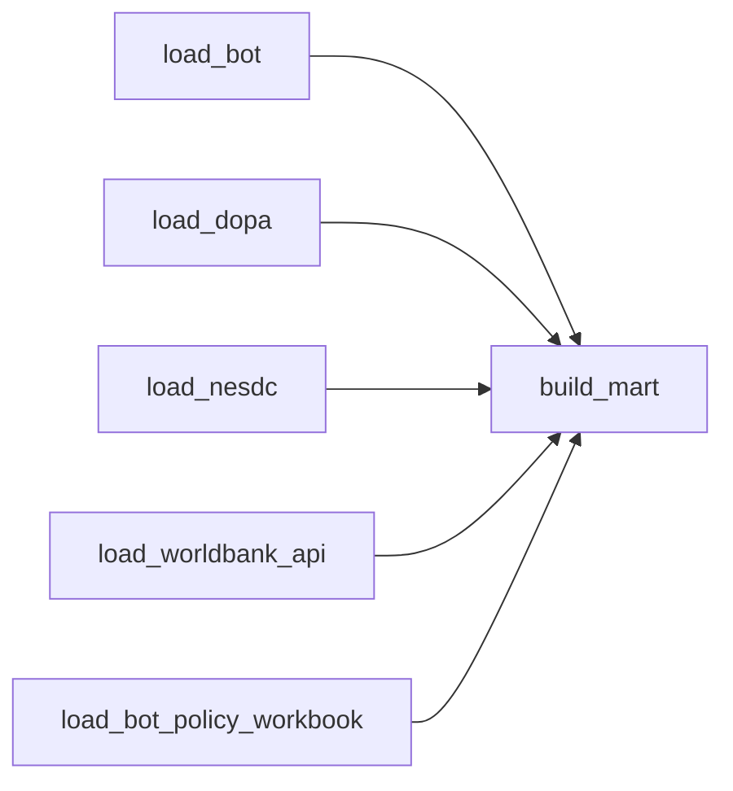

# Architecture & Data Warehouse Design

หลักการ: จังหวัดเป็น crosswalk แบบตรวจมือ 77 code, ไม่ใช้ fuzzy match; แยก grain จังหวัด–เดือนจากจังหวัด–ปีและประเทศ–ปี; ค่า annual เป็น context ล่าสุดที่ทราบตามกติกา availability ไม่ใช่ข้อเท็จจริงรายเดือน. `NULL` หมายถึงไม่มี/ยังใช้ไม่ได้. `source_manifest` และ `etl_run` ผูก provenance และผลรัน แต่ไม่ใช่ fact เชิงธุรกิจ

Airflow DAG ไม่สร้างค่ารายวันจากชุดรายเดือน: รันทุกวันเพื่อตรวจการเผยแพร่หรือ revision และโหลด fact ตามงวดต้นฉบับ การตั้งเวลาใช้ timezone Asia/Bangkok; metadata ของ Airflow อยู่ PostgreSQL ฐาน `airflow` แยกจากฐาน `bank`
